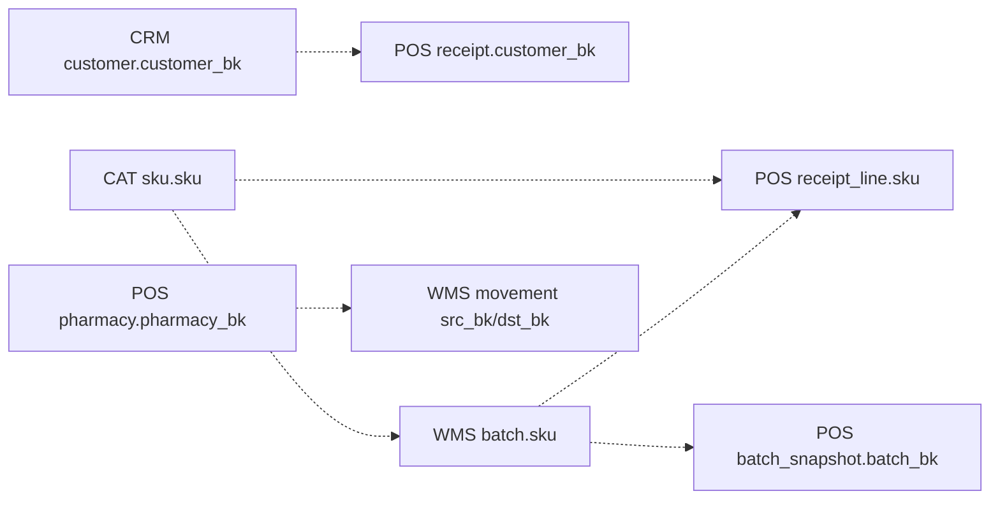

# Логические связи между базами

```mermaid
flowchart LR
  CRM[CRM customer.customer_bk] -.-> POS[POS receipt.customer_bk]
  CAT[CAT sku.sku] -.-> POSL[POS receipt_line.sku]
  CAT -.-> WMS[WMS batch.sku]
  WMS -.-> POSB[POS batch_snapshot.batch_bk]
  PH[POS pharmacy.pharmacy_bk] -.-> WM[WMS movement src_bk/dst_bk]
  WMS -.-> POSL
```

Пунктир — только логическая ссылка по BK; PostgreSQL межбазовые FK не создаёт.
